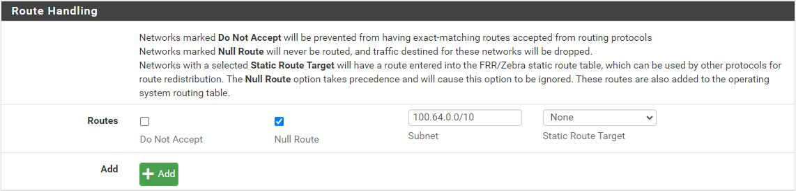

# unifi-pfsense-tailscale

Guide on how to integrate Unifi with pfSense and Tailscale using OSPF

## Introduction

This guide will show you how to integrate Unifi with pfSense and Tailscale using OSPF. This will allow you to reach devices in your tailnet from your Unifi network and vice versa.

## Network Diagram


## Requirements

- A medium to advanced understanding of networking and routing protocols
- pfSense (physical or virtual) with at least 2 interfaces or VLANs
- Unifi Gateway
- Tailscale tailnet
- Tailscale client on a remote device
- SSH access to pfSense and Unifi Gateway

## Not Covered

- Installing pfSense
- Installing a Unifi Gateway
- Setting up a Tailscale tailnet
- Installing Tailscale client on a remote device

## Important Notes

By using OSPF on Unifi, this may not allow you to use the Unifi Site Magic as it requires OSPF to be disabled.

## Unifi Configuration

On your Unifi Gateway, you will need to configure the following:

- Create two networks/VLANs
  - One for the Outside network for for pfSense to connect to the Internet
  - One for the Inside network for pfSense to peer with the Unifi Gateway with OSPF
  - Both networks should use static IP addresses
  - In the example below we will use the following IP ranges:
    - Tailscale tailnet: `100.64.0.0/10`
    - Unifi Networks: `192.168.0.0/16`
    - Outside network: `192.168.220.0/24`
    - Inside network: `192.168.221.0/24`
    - pfSense WAN IP: `192.168.220.11`
    - pfSense LAN IP: `192.168.221.11`

### Unifi OSPF Configuration

Under Settings -> Routing -> OSPF tab, click on `Create New` and configure the following:

- Area ID: `0.0.0.0`
- Area Type: `Normal`
- Network: `Inside network`
- Networks: `pfSense Inside network`

### Unifi IP Group Configuration

Under Settings -> Profiles -> IP Groups, create a new IP group for Tailscale:

- Profile Name: `Tailscale`
- Type: `IPv4 Address/Subnet`
- Address: `100.64.0.0/10`

### Unifi Firewall Rule

Under Settings -> Security -> Traffic & Firewall Rules, configure the following rule using advanced settings:

- Type: `LAN In`
- Name: `Allow LAN to Tailscale`
- Action: `Accept`
- Protocol: `All`
- Source Type: `Network`
- Network: `Your LAN network(s)`
- Network Type: `IPv4 Subnet`
- Destination Type: `Port/IP Group`
- Address Group: `Tailscale`
- Port Group: `Any`

## pfSense Configuration

On your pfSense, install the following packages:

- FRR
- Tailscale

### pfSense Tailscale Configuration

Under VPN -> Tailscale, connect your pfSense to the Tailscale tailnet.

You can follow these instructions for setting up Tailscale on pfSense: <https://flemmingss.com/how-to-set-up-tailscale-on-pfsense/>

Once Tailscale is up, make sure to advertise your routes to the Tailscale tailnet.

You can optionally advertise as an exit node as well.


### Tailscale Configuration

#### Tailscale Admin Console Settings

On your Tailscale admin console:

- Disable key expiry
- Edit route settings to allow all subnets
- Optionally, enable exit node


#### Tailscale Access Control

You can also edit your Access Control settings to allow all devices to communicate with each other.  This can be customized to your needs so it will not be covered in this guide but you can follow the Tailscale documentation.

<https://tailscale.com/kb/1337/acl-syntax>

### pfSense FRR Configuration

#### FRR Global Settings

Under Services -> FRR Global/Zebra, configure the following:

- [x] Enable FRR
- Master Password: `Your password`
- Route Handling:
  - [x] Null Route
  - Subnet: `100.64.0.0/10`
  - Static Route Target: `None`
  - Then click on `Add`



#### FRR Prefix Lists

Under Services -> FRR Global/Zebra -> Prefix Lists, configure the following:

Click on `Add` and configure the following:

- General Options
  - IP Type: `IPv4`
  - Name: `tailscale`
  - Prefix List Entries:
    - Sequence: `10`
    - Action: `Permit`
    - Network: `100.64.0.0/10`
    - Minimum Prefix: `10`


#### FRR Route Maps

Under Services -> FRR Global/Zebra -> Route Maps, configure the following:

Click on `Add` and configure the following:

- General Options
  - Name: `tailscale`
  - Action: `Permit`
  - Sequence: `10`
- Prefix Lists
  - Match Prefix List: `tailscale`

#### FRR OSPF

Under Services -> FRR OSPF, configure the following:

- [x] Enable OSPF Routing
- [x] Log Adjacency Changes
- Router ID: `The Static IP address of the pfSense interface that is connected to the Unifi Gateway on the Inside network`
- Route Redistribution
  - FRR Static Routes
    - [x] Redistribute FRR Static
    - Metric: `10`
    - Route Map: `tailscale`

#### FRR OSPF Interfaces

Under Services -> FRR OSPF -> Interfaces, configure the following by clicking on `Add`:

- Interface: `lan`
- Ignore MTU: `Checked`
- Area: `0.0.0.0`

### NAT Configuration

Under Firewall -> NAT, configure the following:

- Outbound NAT Mode: `Manual Outbound NAT rule generation`

- Under mappings, click on `Add` and configure the following rule:

  - Interface: `Tailscale`
  - Address Family: `IPv4`
  - Protocol: `Any`
  - Source:
    - Type: `Network or Alias`
    - Source Network for the outbound NAT Mapping: `The IP range and mask of your networks on unifi (ex. 192.168.0.0/16)`
  - Destination:
    - Type: `Network or Alias`
    - Destination Network for the outbound NAT Mapping: 100.64.0.0/10
  - Translation:
    - Type: `Network or Alias`
    - Address: The Tailscale Tailnet IP address of your pfSense appliance (ex. 100.64.0.231/32)


Save the rule and apply the changes.

**IMPORTANT: Make sure to move the rule to the top of the list.**

### Firewall Rules

Under Firewall -> Rules -> LAN, configure the following:


Save the rule and apply the changes.

## OSPF Verification

### pfSense

SSH into your pfSense appliance and verify that the OSPF peering is working by running the following command:

```bash
vtysh -c 'show ip ospf neighbor'
```

You should see the Unifi Gateway as a neighbor.

```text
[2.7.2-RELEASE][root@pf1]/root: vtysh -c 'show ip ospf neigh'

Neighbor ID     Pri State           Up Time         Dead Time Address         Interface                        RXmtL RqstL DBsmL
192.168.221.1     1 Full/DROther    2d12h07m          32.952s 192.168.221.1   vtnet1:192.168.221.11                0     0     0
```

To check that pfSense is learning routes from the Unifi Gateway, run the following command:

```bash
vtysh -c 'show ip route ospf'
```

You should see the routes that the Unifi Gateway is advertising.

```text
[2.7.2-RELEASE][root@pf1]/root: vtysh -c 'show ip route ospf'
Codes: K - kernel route, C - connected, S - static, R - RIP,
       O - OSPF, I - IS-IS, B - BGP, E - EIGRP, T - Table,
       v - VNC, V - VNC-Direct, A - Babel, f - OpenFabric,
       > - selected route, * - FIB route, q - queued, r - rejected, b - backup
       t - trapped, o - offload failure

O>* 10.37.110.0/24 [110/20] via 192.168.221.1, vtnet1, weight 1, 2d12h09m
O   100.64.0.0/10 [110/100] via 192.168.221.12, vtnet1, weight 1, 02w6d22h
O>* 192.168.0.0/24 [110/20] via 192.168.221.1, vtnet1, weight 1, 2d12h09m
O>* 192.168.2.0/24 [110/20] via 192.168.221.1, vtnet1, weight 1, 2d12h09m
O>* 192.168.3.0/24 [110/20] via 192.168.221.12, vtnet1, weight 1, 22:24:43
O>* 192.168.10.0/24 [110/20] via 192.168.221.1, vtnet1, weight 1, 2d12h09m
O>* 192.168.25.0/24 [110/20] via 192.168.221.1, vtnet1, weight 1, 2d12h09m
O>* 192.168.26.0/24 [110/20] via 192.168.221.1, vtnet1, weight 1, 2d12h09m
O>* 192.168.40.0/24 [110/20] via 192.168.221.1, vtnet1, weight 1, 2d12h09m
O>* 192.168.120.0/24 [110/20] via 192.168.221.1, vtnet1, weight 1, 2d12h09m
O>* 192.168.200.0/24 [110/20] via 192.168.221.1, vtnet1, weight 1, 2d12h09m
O>* 192.168.201.0/24 [110/20] via 192.168.221.1, vtnet1, weight 1, 2d12h09m
O>* 192.168.202.0/24 [110/20] via 192.168.221.1, vtnet1, weight 1, 2d12h09m
O   192.168.220.0/24 [110/20] via 192.168.221.1, vtnet1, weight 1, 2d12h09m
O   192.168.221.0/24 [110/10] is directly connected, vtnet1, weight 1, 02w6d22h
O>* 192.168.230.0/24 [110/20] via 192.168.221.1, vtnet1, weight 1, 2d12h09m
O>* 192.168.231.0/24 [110/20] via 192.168.221.1, vtnet1, weight 1, 2d12h09m
O>* 192.168.240.0/24 [110/20] via 192.168.221.1, vtnet1, weight 1, 2d12h09m
O>* 192.168.241.0/24 [110/20] via 192.168.221.1, vtnet1, weight 1, 2d12h09m
O>* 192.168.242.0/24 [110/20] via 192.168.221.1, vtnet1, weight 1, 2d12h09m
O>* 192.168.254.0/24 [110/20] via 192.168.221.1, vtnet1, weight 1, 2d12h09m
```

### Unifi Gateway

SSH into your Unifi Gateway and verify that the OSPF peering is working by running the following command:

```bash
vtysh -c 'show ip ospf neighbor'
```

You should see the pfSense firewall as a neighbor.

```text
root@Gateway:~# vtysh -c 'show ip ospf neighbor'

Neighbor ID     Pri State           Dead Time Address         Interface                        RXmtL RqstL DBsmL
192.168.221.11    1 Full/DR           31.282s 192.168.221.11  br221:192.168.221.1                  0     0     0
```

To check that the Unifi Gateway is learning routes from pfSense, run the following command:

```bash
vtysh -c 'show ip route ospf'
```

```text
root@Gateway:~# vtysh -c 'show ip route ospf'
Codes: K - kernel route, C - connected, S - static, O - OSPF,
       B - BGP, T - Table, f - OpenFabric,
       > - selected route, * - FIB route, q - queued, r - rejected, b - backup
       t - trapped, o - offload failure

O>* 100.64.0.0/10 [110/10] via 192.168.221.11, br221, weight 1, 2d13h09m
O   192.168.221.0/24 [110/1] is directly connected, br221, weight 1, 2d13h09m
```

## Tailscale DNS Configuration

If you want to leverage Tailscale DNS for your network, you can configure your DNS server to forward reqeusts for your tailnet domain to the Tailscale DNS server.

See the following guides for more information:

- <https://tailscale.com/kb/1081/magicdns>
- <https://tailscale.com/kb/1381/what-is-quad100>

## Optional Configurations

### pfSense High Availability

If you want to have multiple pfSense appliances in a high availability configuration (for upgrades, reboots etc), you can follow these steps:

#### Tailscale HA Configuration

- Ensure that both pfSense appliances are connected to Tailscale
- Advertise the same routes to the Tailscale tailnet from both pfSense appliances

#### CARP Configuration

Configure CARP on the WAN or LAN interface on the first pfSense appliance with the following settings:

- Synchonize admin
- User manager, users and groups
- Authentication servers
- Firewall rules
- Firewall aliases
- DNS Forwarder and Resolver configuration

#### FRR OSPF Configuration

Configure FRR OSPF on both pfSense appliances with the same settings but modify the following:

- Under Services -> FRR OSPF -> Route Distribution
  - FRR Static Routes
    - Metric: `100`

- Under Services -> FRR OSPF -> Interfaces -> LAN
  - OSPF Interface Handling
  - Metric: `1000`

## Conclusion

You should now have a working OSPF configuration between your pfSense and Unifi Gateway. To test the configuration, try pinging devices on the other side of the network to verify that they can communicate with each other.
